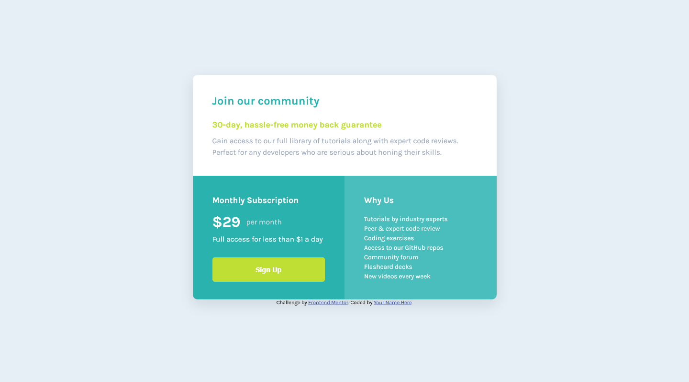

# Frontend Mentor - Single price grid component solution

This is a solution to the [Single price grid component challenge on Frontend Mentor](https://www.frontendmentor.io/challenges/single-price-grid-component-5ce41129d0ff452fec5abbbc). Frontend Mentor challenges help you improve your coding skills by building realistic projects. 

## Table of contents

- [Overview](#overview)
  - [The challenge](#the-challenge)
  - [Screenshot](#screenshot)
  - [Links](#links)
- [My process](#my-process)
  - [Built with](#built-with)
  - [What I learned](#what-i-learned)
  - [Continued development](#continued-development)
  - [Useful resources](#useful-resources)
- [Author](#author)
- [Acknowledgments](#acknowledgments)

**Note: Delete this note and update the table of contents based on what sections you keep.**

## Overview

### The challenge

Users should be able to:

- View the optimal layout for the component depending on their device's screen size
- See a hover state on desktop for the Sign Up call-to-action

### Screenshot

### Links

- Solution URL: [https://github.com/MatheusFukuyama/SimplePriceGrid](https://github.com/MatheusFukuyama/SimplePriceGrid)
- Live Site URL: [https://matheusfukuyama.github.io/SimplePriceGrid/](https://matheusfukuyama.github.io/SimplePriceGrid/)

## My process

### Built with

- Semantic HTML5 markup
- CSS custom properties
- Flexbox
- CSS Grid
- [SASS](https://sass-lang.com/) - Preprocessor

### What I learned

In this project I've learned to use some basic of preprocessor SASS and also how to use the basics of Grid CSS. And I've got better in how make responsives web pages.

### Continued development

With the development of this project I could notice that I had troubles to organize the SASS's files even with a architecture. Furthermore I still don't feel confortable with the HTML tags choseen because I don't know if thouse were the best for the SEO. So for the next project i intend to practice more these filds and update this project while I learn more about the topics quoted before.

### Useful resources

- [https://developer.mozilla.org/pt-BR/docs/Web/CSS/CSS_Grid_Layout/Basic_Concepts_of_Grid_Layout](https://developer.mozilla.org/pt-BR/docs/Web/CSS/CSS_Grid_Layout/Basic_Concepts_of_Grid_Layout) - Grid CSS concepts

- [https://sass-lang.com/guide](https://sass-lang.com/guide) - basic of the SASS

- [https://github.com/KittyGiraudel/sass-guidelines/blob/main/pages/pt/_architecture.md](https://github.com/KittyGiraudel/sass-guidelines/blob/main/pages/pt/_architecture.md) - SASS's architecture
## Author

- Frontend Mentor - [@MatheusFukuyama](https://www.frontendmentor.io/profile/MatheusFukuyama)
